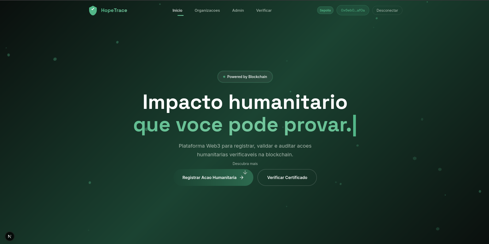
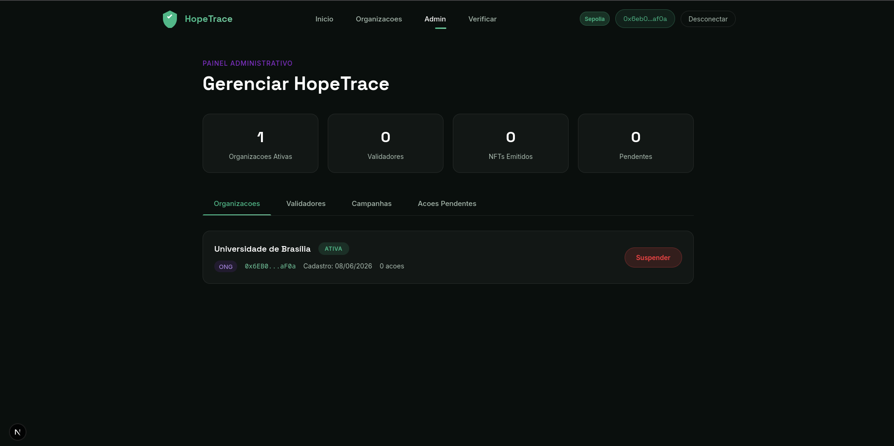
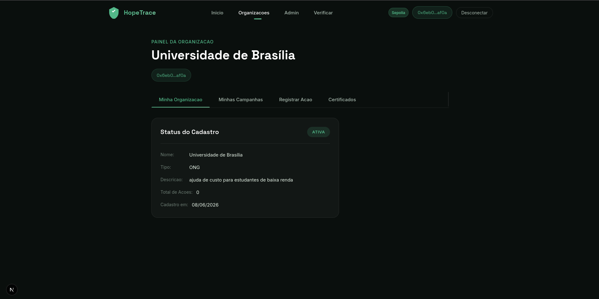
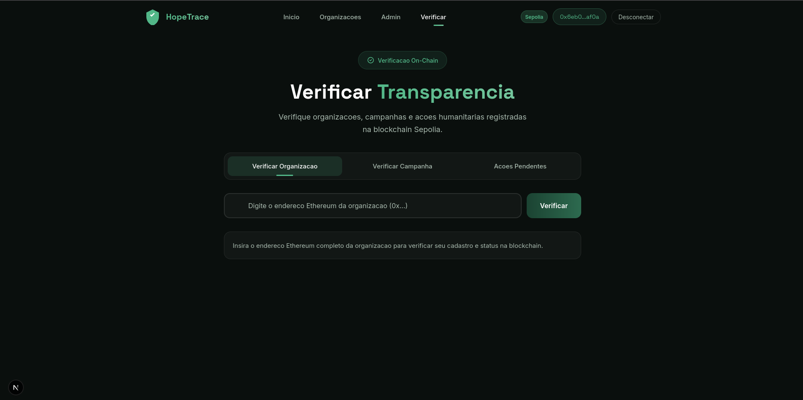
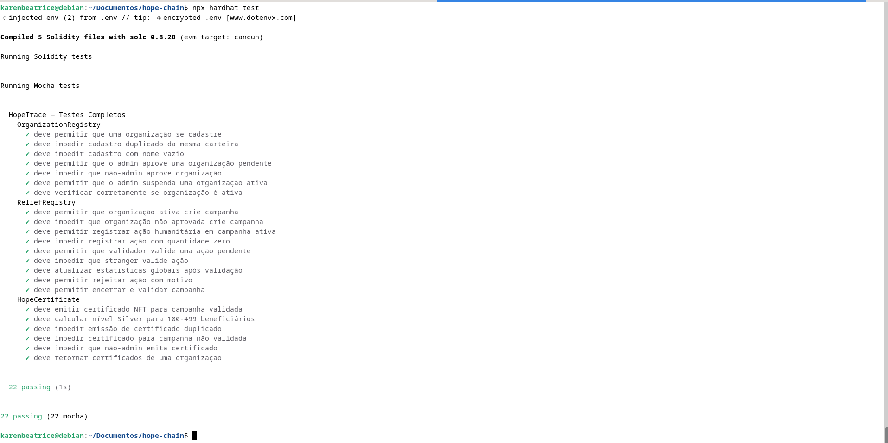

# HopeTrace 🌱

> **Rastreando esperança, registrando impacto.**

Plataforma Web3 para registrar, validar e certificar ações humanitárias verificáveis na blockchain.

---

## 📋 Sobre o Projeto



O HopeTrace é uma plataforma descentralizada que transforma ações humanitárias em registros verificáveis, auditáveis e transparentes na blockchain.

Em situações de emergência — enchentes, crises habitacionais, campanhas de assistência — as ações de ajuda costumam ser registradas de forma fragmentada em planilhas, mensagens e relatórios internos. Isso dificulta a transparência para doadores, governos e comunidades, além de criar riscos de exposição de dados sensíveis das pessoas atendidas.

O HopeTrace resolve esse problema criando uma infraestrutura Web3 onde organizações autorizadas registram abrigos, doações, refeições, kits e atendimentos sociais com evidências digitais verificáveis. O smart contract valida e armazena provas públicas do impacto, enquanto dados pessoais permanecem protegidos fora da blockchain.

---

## 🎯 Problema

Empresas, ONGs, governos e organizações sociais frequentemente enfrentam dificuldades para comprovar ações de impacto humanitário de maneira confiável, transparente e auditável.

Muitas iniciativas ainda dependem de:
- Relatórios manuais e planilhas
- Registros internos sem rastreabilidade
- Fotos ou documentos isolados
- Validações pouco padronizadas
- Métricas difíceis de auditar

Esse cenário gera baixa rastreabilidade, ausência de métricas confiáveis, dificuldade de validação e baixa confiança de apoiadores, empresas e comunidades.

---

## 💡 Solução

O HopeTrace utiliza blockchain e smart contracts para:

- ✅ **Registrar** ações humanitárias com evidências criptográficas
- ✅ **Validar** cada ação por auditores independentes autorizados
- ✅ **Certificar** campanhas com NFTs verificáveis no Etherscan
- ✅ **Preservar privacidade** — dados pessoais ficam off-chain (IPFS)
- ✅ **Auditar publicamente** — qualquer pessoa pode verificar o impacto

---

## 🏗️ Arquitetura

### Smart Contracts (Modular)

| Contrato | Responsabilidade |
|----------|-----------------|
| `OrganizationRegistry.sol` | Controla quais organizações são autorizadas — identidade e acesso |
| `ReliefRegistry.sol` | Registra campanhas e ações humanitárias — validação e métricas |
| `HopeCertificate.sol` | Emite certificados NFT para campanhas validadas — ERC-721 |

### Fluxo Principal

Organização solicita cadastro
Admin aprova organização
Organização cria campanha humanitária
Organização registra ações com evidência IPFS
Validador independente aprova cada ação
Admin valida a campanha inteira
Smart contract emite NFT automaticamente
Dashboard público exibe impacto verificável

### Privacidade por Design

Dados sensíveis dos beneficiários **nunca** são armazenados on-chain. A blockchain guarda apenas:
- Tipo e quantidade da ação
- Hash IPFS da evidência (âncora criptográfica)
- Organização responsável
- Status de validação

### Stack Tecnológico

| Camada | Tecnologia |
|--------|-----------|
| Smart Contracts | Solidity 0.8.28 + OpenZeppelin |
| Testes | Hardhat 3 + Mocha + Ethers.js |
| Blockchain | Sepolia Testnet |
| Frontend | Next.js 15 + React |
| Integração Web3 | Ethers.js v6 + MetaMask |
| Armazenamento off-chain | IPFS (Pinata) |

---

## 📦 Contratos Deployados — Sepolia Testnet

| Contrato | Endereço |
|----------|----------|
| OrganizationRegistry | `0x44451A3A15dF8216423D1388995eB9d7ed88A5D7` |
| ReliefRegistry | `0x65258f297333013c25025730812658591B59d09C` |
| HopeCertificate (NFT) | `0x8Fe20a5F042e485cb494BFC25E8CDb9376e592D0` |

🔍 Verificar no Etherscan:
- [OrganizationRegistry](https://sepolia.etherscan.io/address/0x44451A3A15dF8216423D1388995eB9d7ed88A5D7)
- [ReliefRegistry](https://sepolia.etherscan.io/address/0x65258f297333013c25025730812658591B59d09C)
- [HopeCertificate](https://sepolia.etherscan.io/address/0x8Fe20a5F042e485cb494BFC25E8CDb9376e592D0)

---

## 🖥️ Screenshots







---

## 🚀 Como Executar

### Pré-requisitos

- Node.js v22+
- MetaMask instalado no navegador
- ETH de teste na Sepolia

### 1. Clonar o repositório

```bash
git clone https://github.com/karenbeat/hopetrace
cd hopetrace
```

### 2. Instalar dependências dos contratos

```bash
npm install
```

### 3. Compilar os contratos

```bash
npx hardhat compile
```

### 4. Executar os testes

```bash
npx hardhat test
```

### 5. Deploy na Sepolia

Crie um arquivo `.env` na raiz:

SEPOLIA_RPC_URL=https://eth-sepolia.g.alchemy.com/v2/SUA_KEY
SEPOLIA_PRIVATE_KEY=SUA_PRIVATE_KEY
```bash
npx hardhat ignition deploy ignition/modules/HopeTrace.ts --network sepolia
```

### 6. Executar o frontend

```bash
cd frontend
npm install
npm run dev
```

Acesse: `http://localhost:3000`

---

## 🧪 Testes

O projeto conta com **22 testes** cobrindo todos os fluxos críticos:

```bash
npx hardhat test
```



 	
HopeTrace — Testes Completos
OrganizationRegistry (7 testes)
ReliefRegistry (9 testes)
HopeCertificate (6 testes)
22 passing
---

## 🎭 Perfis de Usuário

| Perfil | Permissões |
|--------|-----------|
| **Admin** | Aprova organizações, adiciona validadores, valida campanhas, emite NFTs |
| **Organização** | Solicita cadastro, cria campanhas, registra ações com evidências IPFS |
| **Validador** | Valida ou rejeita ações individuais como auditor independente |
| **Público Geral** | Consulta organizações, campanhas e ações sem necessidade de carteira |

---

## 🔮 Melhorias Futuras

- Painéis separados para Admin, Organizações e Sociedade Civil
- Painel para cidadãos oferecerem ajuda diretamente (abrigo, transporte, alimentos)
- Sistema de login com autenticação Web3 (Sign-In with Ethereum)
- Integração com múltiplas redes (Polygon, Arbitrum)
- Sistema de reputação on-chain para organizações
- Notificações em tempo real via eventos blockchain
- Dashboard analítico avançado com métricas de impacto territorial
- Acentuação das palavras, tive um problema com a fonte e precisei remover toda a acentuação e pontuação

---

## 👥 Equipe

| Nome | Papel |
|------|-------|
| Karen Beatrice | Desenvolvedora — Smart Contracts, Frontend e Integração Web3 |

---

## 🤖 Ferramentas de IA Utilizadas

Conforme política de transparência do Hackweb:

| Ferramenta | Uso |
|------------|-----|
| Claude (Anthropic) | Formatação dos contratos, lógica de integração |
| v0 (Vercel) | Geração inicial do frontend |
| Gamma AI | Estética dos slides |


A autoria intelectual, supervisão, tomada de decisões de produto e compreensão técnica são da desenvolvedora. Todo o código foi revisado, adaptado e integrado manualmente.

---

## 📄 Licença

MIT License — veja o arquivo [LICENSE](LICENSE) para detalhes.
